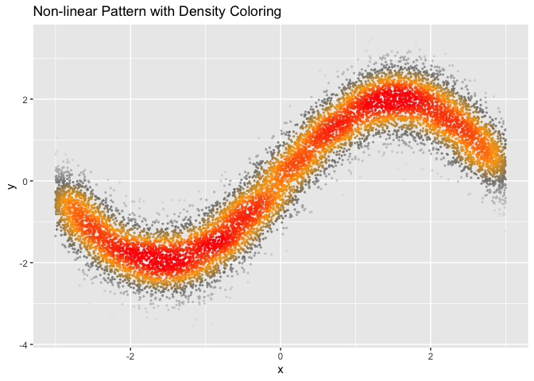

<!-- badges: start -->

[](https://travis-ci.org/tanaylab/tgutil)
[](https://codecov.io/gh/tanaylab/tgutil?branch=master)
<!-- badges: end -->

# tgutil package - Tanay’s group collection of simple utility functions

## Installation

You can install tgutil with:

``` r
remotes::install_github("tanaylab/tgutil")
```

## Read legacy csv’s

### fread_rownames

``` r
fread_rownames(..., row.var = "rowname")
```

Use `fread()` to read a csv/tsv with row names (e.g. one created with
`read.table()`). The name of the column that will hold the row names is
given in `row.var`.

All arguments are passed to the underlying `fread()` call. Note that the
following arguments can’t be used (and will be silently ignored):
`header`, `skip`, `col.names`.

## Sparse Matrix I/O

### fwrite_mm

``` r
fwrite_mm(x, fname, sep = " ", row.names = TRUE, col.names = TRUE)
```

Write the contents of the sparse matrix `x` into the text file `fname`
in the MatrixMarket format (see
<http://math.nist.gov/MatrixMarket/formats.html>).

The MatrixMarket format does not save row and column names.
`fwrite_mm()` allows saving them into separate files using the
`row.names` and `col.names` arguments. These arguments may contain file
names into which the column and row names will be written. Alternately
setting these arguments to `TRUE` will cause the row and column names to
be written to `<fname>.rownames` and `<fname>.colnames` respectively.

The argument `sep` indicates the field separator that will be used. Note
that using any field separator other than space will result in an output
that is not compliant with the MatrixMarket format.

### fread_mm

``` r
fread_mm(fname, sep = " ", row.names = TRUE, col.names = TRUE)
```

Reads a sparse matrix in the MatrixMarket format from the file `fname`.

The MatrixMarket format does not save row and column names. `fread_mm()`
allows reading them from separate files using the `row.names` and
`col.names` arguments. These arguments may contain file names from which
the column and row names will be read. Alternately setting these
arguments to `TRUE` will cause the row and column names to be read from
`<fname>.rownames` and `<fname>.colnames` respectively.

## Dense scatter plots

### geom_dense_scatter

``` r
library(tgutil)
library(ggplot2)
n <- 1e4

# Create large dataset with non-linear relationship
x <- runif(n, -3, 3)
df2 <- data.frame(
    x = x,
    y = sin(x) * 2 + rnorm(n, 0, 0.5)
)

# Visualize non-linear relationship with density
ggplot(df2, aes(x, y)) +
    geom_dense_scatter(
        pal = c("gray90", "gray50", "orange", "red"),
        size = 0.4,
        alpha = 0.8
    ) +
    labs(title = "Non-linear Pattern with Density Coloring")
```

<!-- -->
